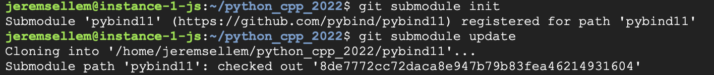
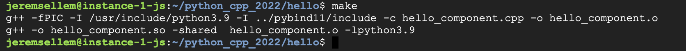
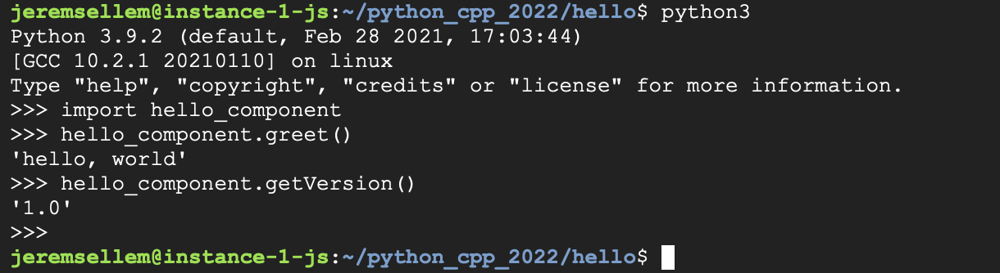

# python_cpp
* Installation

* Compilation

* Exécution


Exemple d'utilisation d'un composant en python
Utilise pybind11
apres git clone, faire:
```
cd python_cpp
git submodule init
git submodule update
```

Pour compiler

```
cd hello
make
```

Pour utiliser
```
python3
>>> import hello_component
>>> hello_component.greet()
'hello, world'
>>> hello_component.getVersion()
'1.0'
>>> 
```
