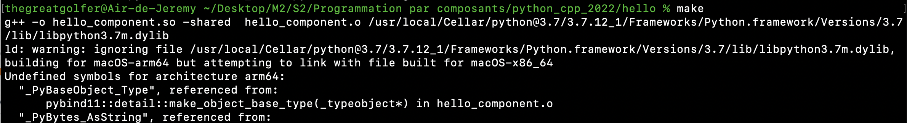

# python_cpp
Je n'ai pas réussi à lancer l'objet C++ :
* Sur Mac j'obtiens une erreur (compatibilité avec la nouvelle puce Apple M1 apparemment)

* Sur Ubuntu j'obtiens une erreur file Python.h not found. J'ai cherché sur internet toutes les solutions mais aucune ne fonctionne


Cet exercice sera fait en salle à Dauphine sur les machines du CRIO.

Exemple d'utilisation d'un composant en python
Utilise pybind11
apres git clone, faire:
```
cd python_cpp
git submodule init
git submodule update
```

Pour compiler

```
cd hello
make
```

Pour utiliser
```
python3
>>> import hello_component
>>> hello_component.greet()
'hello, world'
>>> hello_component.getVersion()
'1.0'
>>> 
```
